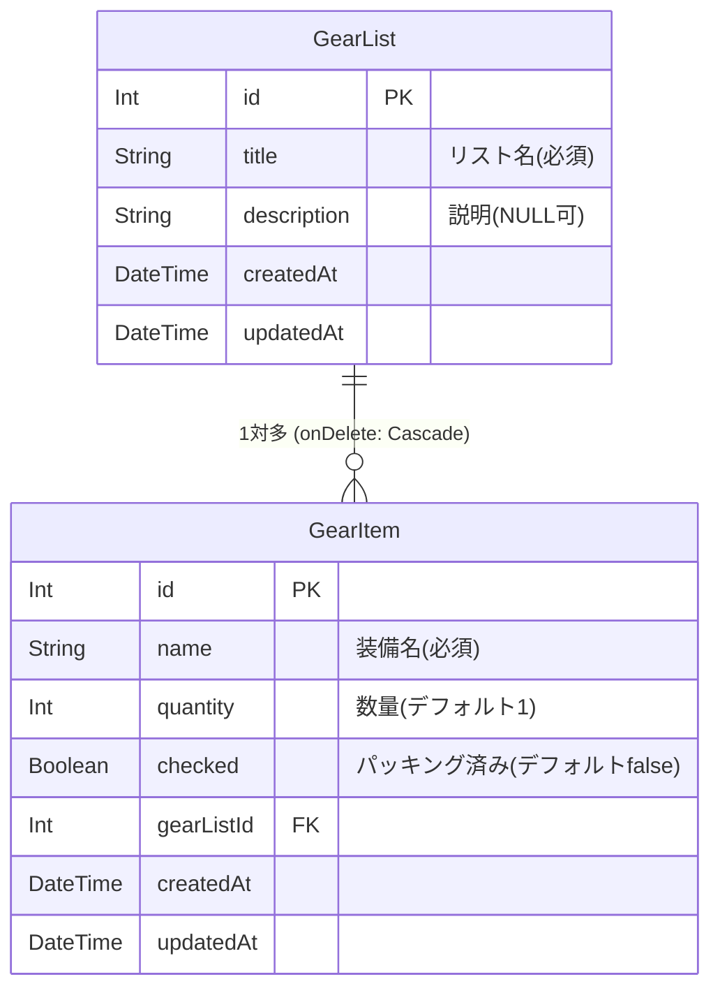

# Gear List — 登山装備チェックリスト管理アプリ

登山の装備リストを作成し、装備品のパッキング状況をチェックできる Web アプリです。

- 装備リスト(例:「夏山日帰り」「冬山日帰り」)の作成・削除
- リストへの装備品の追加・削除、数量の管理
- 装備品ごとの**パッキング済みチェック**(チェック済みは打ち消し線で表示)
- 初期データとして、山岳救助経験に基づく「夏山日帰り(21点)」「冬山日帰り(20点)」を収録

## 技術スタック

| 領域 | 技術 |
|---|---|
| フロントエンド | Next.js 16(App Router)/ React 19 / TypeScript / Tailwind CSS |
| バックエンド | Hono 4(@hono/node-server)/ TypeScript |
| バリデーション | Zod 4(@hono/zod-validator) |
| ORM | Prisma 6 |
| データベース | PostgreSQL 16(Docker) |

## 構成

```
ブラウザ ──画面要求──▶ Next.js (3000) ──fetch──▶ Hono (8787) ──Prisma──▶ PostgreSQL (5432)
   │                                                 ▲
   └────── 作成・更新・削除は直接 API を呼ぶ ──────────┘ (CORS 設定済み)
```

- **表示(読み取り)**: Server Component がサーバー間通信で API を呼び、HTML を生成
- **操作(書き込み)**: Client Component がブラウザから API を直接呼び、`router.refresh()` で画面を最新化

```
├── frontend/            # Next.js (App Router)
│   ├── app/             # ページ(ディレクトリ構造 = URL)
│   ├── components/      # Client Component(フォーム・ボタン・チェックボックス)
│   ├── lib/api.ts       # fetch ラッパー(API 呼び出しを一元管理)
│   └── types/           # API レスポンスの型定義
├── backend/             # Hono
│   ├── src/
│   │   ├── index.ts     # サーバー起動・CORS・ルーティング
│   │   ├── routes/      # エンドポイント定義
│   │   ├── schemas/     # Zod スキーマ(入口バリデーション)
│   │   └── lib/         # PrismaClient シングルトン・共通処理
│   └── prisma/          # スキーマ・マイグレーション・シード
└── docker-compose.yml   # PostgreSQL
```

## ER 図



リスト削除時、所属する装備品は DB の外部キー制約(`ON DELETE CASCADE`)により連動削除されます。

## API 一覧

ベース URL: `http://localhost:8787/api`

| メソッド | パス | 説明 | 成功 | 異常 |
|---|---|---|---|---|
| GET | `/health` | ヘルスチェック | 200 | — |
| GET | `/lists` | リスト一覧 | 200 | — |
| GET | `/lists/:id` | リスト詳細(装備品含む) | 200 | 404 / 400 |
| POST | `/lists` | リスト作成 | 201 | 400 |
| PATCH | `/lists/:id` | リスト更新(部分更新) | 200 | 404 / 400 |
| DELETE | `/lists/:id` | リスト削除(装備品も連動削除) | 204 | 404 / 400 |
| POST | `/lists/:listId/items` | 装備品追加 | 201 | 404 / 400 |
| PATCH | `/items/:id` | 装備品更新(チェック切替・名称・数量) | 200 | 404 / 400 |
| DELETE | `/items/:id` | 装備品削除 | 204 | 404 / 400 |

- エラーレスポンスは `{ "error": "メッセージ" }` 形式で統一
- 400 = バリデーションエラー(Zod)、404 = リソース不在

## セットアップ

前提: Node.js 22+ / Docker

```bash
# 1. リポジトリを取得
git clone https://github.com/kou-pro/gear-list.git
cd gear-list

# 2. PostgreSQL を起動
docker compose up -d

# 3. バックエンド
cd backend
npm install
cp .env.example .env          # DATABASE_URL の設定
npx prisma migrate dev        # テーブル作成 + Prisma Client 生成
npx prisma db seed            # 初期データ投入(夏山・冬山)
npm run dev                   # http://localhost:8787

# 4. フロントエンド(別ターミナルで)
cd frontend
npm install
npm run dev                   # http://localhost:3000
```

ブラウザで http://localhost:3000 を開くと、シードデータの2リストが表示されます。

### 動作確認(API 単体)

```bash
curl http://localhost:8787/api/health          # {"status":"ok"}
curl http://localhost:8787/api/lists           # リスト一覧
```

## 主な設計判断

詳細は各 Pull Request の説明に記録しています。

| テーマ | 判断 |
|---|---|
| `checked` を GearItem 本体に持たせる | 履歴・ユーザー別状態が不要な規模で Check テーブルを分離するのは過剰設計 |
| カスケード削除を DB 制約で実現 | アプリ層のループ削除と違い、SQL を直接叩かれても整合性が保たれる |
| バリデーションは入口(Zod)で実施 | 不正データを 400 で返し、DB 到達時の 500 を防ぐ。id には INT4 上限チェックも実施 |
| PATCH の `undefined` / `null` の区別 | `undefined` = 変更しない、`null` = NULL をセット。Prisma の仕様に沿った部分更新 |
| 404 は Prisma のエラーコードで判定 | update/delete は P2025、外部キー起因(親リスト不在)は P2003 を catch。事前 SELECT を省きクエリ1回で済ませる |
| DELETE は 204 No Content | 削除成功に返すボディは無い。204 はボディを持てないため `c.body(null, 204)` |
| 表示は Server Component / 操作は Client Component | 読み取りはサーバー間通信(CORS 不要)、書き込みのみブラウザから直接 API を呼ぶ(CORS は origin を限定して許可) |
| 画面と API でエラー表現を分ける | 不正な URL(`/lists/abc`)は API では 400、画面では 404 ページ。利用者に "Bad Request" を見せない |
| seed は冪等 | 先頭で全削除してから投入。何度実行しても同じ結果になる |

## スコープ外・今後の改善候補

- 認証・ユーザー管理、画像アップロード、デプロイ(課題のスコープ外)
- リスト編集 UI(`PATCH /api/lists/:id` は実装済み、画面は未接続)
- API ベース URL の環境変数化(`NEXT_PUBLIC_` プレフィックス)
- `error.tsx` によるエラー画面、リスト複製 API、装備の合計重量表示
